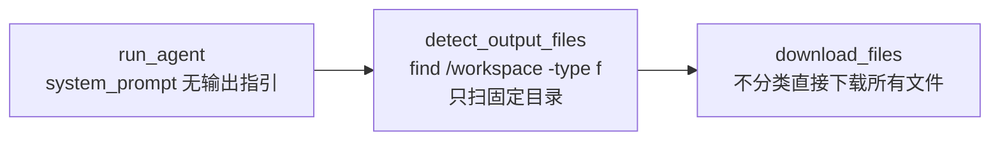

# Agent 智能升级计划

> status: approved
> priority: P0
> created: 2026-05-29
> updated: 2026-05-31 (方向一已完成, 方向五已合并)
>
> 目标：将当前"确定性流水线"架构升级为"自适应智能体循环"

---

## 痛点总览

当前架构是一条单向流水线 DAG：

```
analyze_intent(关键词) → create_sandbox → upload_files → run_agent(黑盒) → detect_output → download → cleanup
```

七个核心问题：

| # | 问题 | 位置 | 后果 |
|---|------|------|------|
| 1 | 意图分析靠 8 个关键词 | `analyze_intent` | 大量误判/漏判 |
| 2 | 无反馈闭环 | 整个 graph | 一次跑完，失败无法恢复 |
| 3 | run_agent 是黑盒 | `run_agent` | 外部无法干预 DeepAgent 内部循环 |
| 4 | 记忆原始 | `main.py` + `state.py` | 跨轮对话无真正持久化 |
| 5 | 文件发现但不理解 | `detect_output_files` | 扫描了但不分析文件类型/内容 |
| 6 | 静态沙箱模板 | `nodes.py` | 所有任务用同一个镜像 |
| 7 | 资源管理简陋 | `client.py` | 全局字典无清理，事件循环永不停止 |

---

## 方向一：LLM 驱动意图理解 + 动态任务规划 ⬜⬜⬜✅

> 状态：**已完成**（2026-05-29 提交 `feat/llm-intent-analysis` 分支）

### 变更文件

| 文件 | 变更 |
|------|------|
| `src/agent/state.py` | 新增 `task_type` / `intent_reasoning` / `suggested_template` 字段 |
| `src/agent/nodes.py` | `analyze_intent` 改为 LLM 驱动，新增 `_INTENT_SYSTEM_PROMPT` / `_parse_intent_json`；`create_sandbox` 使用 `state.suggested_template` |
| `src/agent/graph.py` | `route_after_analysis` 改用 `task_type` 做分支判断 |
| `src/sandbox/client.py` | 新增 `_TEMPLATE_REGISTRY` 映射表；`create_sandbox` 按 `template_name` 查表选择镜像/entrypoint/env |
| `AGENTS.md` | 新增 `analyze_intent` LLM 行为约束说明 |
| `README.md` | 更新架构图展示 5 分类路由 |

### 提交历史

```
e281c54 feat: implement dynamic template selection via TEMPLATE_REGISTRY
db6c491 docs: update intent analysis architecture in AGENTS.md and README.md
33b39a4 feat: replace keyword intent analysis with LLM-driven classification
```

### 实现要点

- 使用 `ChatOpenAIWithReasoning` 对用户消息做意图分类，返回 JSON 格式
- 分类：`chat` / `compute` / `code_exec` / `data_analysis` / `multi_step`
- `chat` 和 `compute` 不进沙箱，直接 LLM 回复
- `code_exec` / `data_analysis` / `multi_step` 进沙箱，动态选择模板
- LLM 调用失败时自动回退到关键词匹配（原有逻辑）
- `_parse_intent_json` 兼容 LLM 可能返回的 markdown 代码围栏
- `_INTENT_SYSTEM_PROMPT` 常量集中管理提示词，修改行为应改此常量而非关键词列表

---

## 方向二：引入评估-重试闭环

### 现状

```
run_agent → detect_output → download → cleanup → END
```
不管结果好坏，一路走到黑。

### 目标

```
run_agent → evaluate_result
               │
          ┌────┴────┐
          │ 通过     │ 不通过
          ▼          ▼
    继续流程      重新规划
                    │
               ┌────┴────┐
               │ 重试 > N │ 重试 ≤ N
               ▼          ▼
            cleanup    回到 create_sandbox
            + 报错      或 run_agent
```

### 方案要点

- 新增 `evaluate_result` 节点，让 LLM 判断执行结果质量
- 新增 `retry_count` 状态字段，防止无限重试
- 条件边：通过 → 继续；不通过且 retry_count < max → 重试；否则 → 报错退出
- `cleanup_sandbox` 改为条件节点（成功时不销毁，允许用户继续对话）

### 涉及文件

- `src/agent/state.py` — 加 `retry_count`, `max_retries`, `evaluation`
- `src/agent/nodes.py` — 加 `evaluate_result` 节点
- `src/agent/graph.py` — 加条件回环边

---

## 方向三：Human-in-the-Loop

### 现状

用户发一条消息后全程旁观，无法中途干预。

### 目标

关键节点插入人类确认：
- **文件下载前**：询问用户要下载其中哪些文件
- **沙箱重试前**：询问用户是否要重试，还是换一种方式
- **复杂意图**：意图模糊时反问用户澄清

### 方案要点

- 新增 `confirm_download` 节点，调用 `input()` 或 API 等待用户选择
- `state.pending_files` 字段暂存待下载文件列表
- LangGraph 的 `interrupt_before` 机制（如果走 API 模式）
- REPL 模式下用 `input()` 阻塞等待；API 模式下返回 `pending_confirmation` 状态码

### 涉及文件

- `src/agent/state.py` — 加 `pending_downloads`, `awaiting_confirmation`
- `src/agent/nodes.py` — 加 `confirm_download`, `clarify_intent`
- `main.py` — 处理确认交互

---

## 方向四：持久化记忆系统

### 现状

```python
messages: list[dict] = []                           # REPL: 纯内存
config = {"configurable": {"thread_id": "interactive-session"}}  # 固定 ID
```

### 目标

- 接入 LangGraph 的 `SqliteSaver` 或 `MemorySaver`，不同 thread_id 隔离会话
- 每个 REPL 会话使用不同 thread_id
- 支持跨轮对话时复用上下文

### 方案要点

- `build_graph()` 接受 `checkpointer` 参数
- REPL 模式启动时生成随机 thread_id
- 历史消息持久化到本地 `.sisyphus/sessions/` 目录
- 支持 `/history last` 只看本轮、`/history all` 看全部

### 涉及文件

- `src/agent/graph.py` — 接受 checkpointer 参数
- `main.py` — 改为单例 graph，按会话使用不同 thread_id
- `src/agent/state.py` — 可能需要扩展持久化字段

---

## 方向五：智能文件处理 ✅

> 状态：**已完成**（2026-05-31 合并至 `feat/file-discovery` 分支）

### 现状（改造前）



三个断层：
1. **Agent 无输出指引** — system_prompt 只说"你有沙箱"，没说"把输出存哪里"
2. **扫描范围窄** — `find /workspace` 会漏掉 agent 写到 `/tmp/`、`/home/` 的文件
3. **下载无脑** — 扫到什么就下载什么，不分析、不分类、不给用户看摘要

### 目标

分两个阶段：

**阶段 A：让文件能被找到（补当前缺口）**
- agent 执行前主动告知输出位置 → 减少迷路的文件
- 多路径扫描兜底 → 即使 agent 没听话也能找回来
- 下载时给用户清晰的结果提示 → 隐藏沙箱细节

**阶段 B：智能分析（原方向五）**
- `*.csv` / `*.xlsx` → 自动 pandas 预览前 5 行，把摘要发给 LLM 解读
- `*.png` / `*.jpg` → 自动生成 base64 图片预览（API 模式支持图片回显）
- `*.log` → 自动提取 error/warning 行数统计
- `*.html` → 提取页面标题和 meta 信息

### 方案要点

**阶段 A（文件发现 + UX 改进）：**

1. `run_agent` 的 system_prompt 增加输出规范：
   ```
   "3. ALWAYS save ALL output files to /workspace/output/\n"
   "4. The system automatically delivers /workspace/output/ files to you"
   ```

2. `detect_output_files` 改为多路径扫描：
   ```
   一级: /workspace/output/     ← agent 遵循指引时的首选
   二级: /workspace/ (排除 input) ← 兼容未按规范存的情况
   三级: /tmp/ /home/ /root/   ← 兜底，过滤 pip 缓存 / __pycache__
   ```

3. `download_files` 增加结果摘要打印，给用户清晰的完成反馈：
   ```
   ✅ 处理完成，以下文件已就绪：
      📄 report.csv → downloads/report.csv
   ```

**阶段 B（智能分析 — 原方向五内容）：**

4. `detect_output_files` 返回结构化结果：`[{path, mime_type}]`
5. 新增 `analyze_output_files` 节点，用 LLM 判断每个文件的价值
6. 高价值文件自动下载 + 生成摘要；低价值文件仅列路径

### 涉及文件

**阶段 A：**
- `src/agent/nodes.py` — `run_agent` 改 system_prompt + `detect_output_files` 改扫描路径 + `download_files` 增加结果摘要

**阶段 B：**
- `src/agent/nodes.py` — 重写 `detect_output_files` 返回结构化结果 + 新增 `_detect_mime_type`/`_generate_preview`/`_get_file_size` 辅助函数 + 新增 `analyze_output_files` 节点 + `_ANALYZE_FILES_PROMPT` 意图感知提示 + `download_files` 仅下载高价值文件
- `src/agent/state.py` — 新增 `OutputFile` TypedDict；`output_files` 类型改为 `list[OutputFile]`
- `src/agent/graph.py` — 注册新节点 + 连线 `detect_output_files → analyze_output_files → download_files`
- `README.md` — 架构图更新新增 `analyze_output_files` 节点

### 提交历史

```
24697ad feat: add intelligent output file analysis with user-intent-aware value judgment
21251bc fix: update output_files type annotation to match structured data
16db3e0 fix: restrict detect_output_files to /workspace/output/ only
b1a917e feat: broaden file discovery and add agent output guidance
```

### 实现要点

- `_detect_mime_type()`: 基于文件扩展名和`file`命令混合判断 MIME 类型
- `_generate_preview()`: 每类 MIME 有不同预览策略 — 文本前 5 行、log 统计 error/warning、HTML 提取 title、图片标记尺寸、二进制仅显示类型和大小
- `_ANALYZE_FILES_PROMPT`: 使用 `{user_request}` + `{task_type}` + `{file_details}` 三个占位符，让 LLM 基于用户实际需求判断文件价值，而非简单按文件类型（如：用户要冒泡排序脚本 → `bubble_sort.py` 标记为高价值）
- LLM 调用失败时自动降级：全部文件默认高价值，确保不遗漏

---

## 方向六：动态沙箱模板

### 现状

```python
TEMPLATE_NAME = "python-sandbox"
```

### 目标

根据 task_type 选择不同的沙箱镜像：

| task_type | 镜像 | 预装 |
|-----------|------|------|
| code_exec | python-sandbox | Python 3.11 |
| data_analysis | python-sandbox + pip deps | pandas, numpy, matplotlib |
| web_dev | node-sandbox | Node 20, npm |
| cpp_build | cpp-sandbox | gcc, cmake, make |

### 方案要点

- 在 `analyze_intent` 阶段推断 `suggested_template`
- `create_sandbox` 根据 `suggested_template` 选择镜像
- 沙箱配置集中管理（新增 `src/sandbox/templates.py`）

### 涉及文件

- 新增 `src/sandbox/templates.py`
- `src/agent/nodes.py` — `create_sandbox` 使用动态模板
- `src/agent/state.py` — 加 `suggested_template` 字段

---

## 方向七：资源管理改进

### 现状

```python
_GLOBAL_SANDBOXES = {}  # 只增不减
_LOOP_THREAD = threading.Thread(target=..., daemon=True)  # 永不停止
```

### 目标

- 全局沙箱字典加 TTL 过期机制
- 最大并发沙箱数限制（可配置）
- 后台事件循环优雅关闭
- 沙箱资源使用统计（创建时间、命令数、总耗时）

### 方案要点

- `_GLOBAL_SANDBOXES` 改为 `OrderedDict` + 后台清理协程
- `SandboxClient` 增加 `max_sandboxes` 参数，超出时拒绝创建
- `cleanup_sandbox` 同时清理全局字典和通知事件循环

### 涉及文件

- `src/sandbox/client.py` — 重写全局字典管理
- `src/config.py` — 加 `max_sandboxes` 配置
- `src/agent/nodes.py` — `cleanup_sandbox` 增强

---

## 实施优先级

```
第一优先（低 hanging fruit，高 ROI）：
  方向一 + 方向三（意图理解 + human-in-the-loop）
  → 让 Agent 像个真人一样先想后做，错了能问

第二优先（核心智力提升）：
  方向二（评估-重试闭环）
  → 让 Agent 能自我修正

第三优先（体验质变）：
  方向五（智能文件处理）
  → 用户看到的不只是文件路径，而是结果解读

第四优先（规模化）：
  方向四 + 方向六 + 方向七
  → 记忆、模板、资源管理

支线：前端 Web UI
  → 关联计划：`.sisyphus/plans/web-ui.md`
  → 提供浏览器端聊天界面，随 agent 迭代同步更新
```

---

## 附录：相关文件索引

| 文件 | 行数 | 职责 |
|------|------|------|
| `src/agent/nodes.py` | 232 | 所有处理节点 |
| `src/agent/state.py` | 23 | 状态定义 |
| `src/agent/graph.py` | 71 | 图编排 |
| `src/sandbox/client.py` | 171 | 沙箱客户端 + 异步桥 |
| `src/sandbox/backend.py` | 93 | DeepAgent 沙箱后端 |
| `src/config.py` | 76 | 配置中心 |
| `main.py` | 218 | CLI 入口 |
| `src/llm.py` | 172 | LLM 兼容层 |
| `api.py` | (待查) | API 入口 |
| `AGENTS.md` | (已有) | AI 行为约束 |
| `README.md` | (已有) | 项目文档 |
| `static/index.html` | (新增) | Web UI 页面骨架 |
| `static/style.css` | (新增) | Web UI 样式 + 暗色模式 |
| `static/app.js` | (新增) | Web UI 交互逻辑 |
| `.sisyphus/plans/web-ui.md` | (新增) | Web UI 实施计划 |
| `.sisyphus/workflows/branch-management.md` | (新增) | 分支管理工作流标准 |
