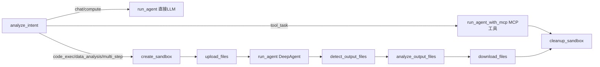

# Agent 编排流水线原理

> 本文档解释 LangGraph 状态机如何组织 gtg_agent 的执行流程，
> 帮助理解节点（Node）、边（Edge）、路由（Router）、状态（State）之间的关系。
>
> **关键文件**: `src/agent/` 下的 state.py / nodes.py / graph.py

---

## 1. 整体架构

系统使用 **LangGraph** 的 `StateGraph` 构建一个有向无环图（DAG），每个节点是一个独立的功能单元。

```
StateGraph 生命周期:
  输入 ──→ [节点1] ──→ [节点2] ──→ ... ──→ [节点N] ──→ 输出
               ↑              ↑                     ↑
           读取账本       修改账本               读取最终状态
           (State)       (State)               (State)
```

**核心概念**：
- **State（账本）**：所有节点共享的字典，每个节点可以读/写它的字段
- **Node（车间）**：一个函数，接收 State，返回要更新的字段
- **Edge（传送带）**：节点间的固定连接（`A → B`）
- **Conditional Edge（道岔）**：根据当前 State 内容动态选择下一个节点

---

## 2. 状态设计（SandboxAgentState）

`SandboxAgentState` 继承自 `MessagesState`（自动管理聊天消息列表），扩展了 10 个字段：

| 字段 | 写入者 | 读取者 | 用途 |
|------|--------|--------|------|
| `messages` | run_agent | 所有节点 | 对话历史（MessagesState 内置） |
| `task_type` | analyze_intent | route_after_analysis, analyze_output_files | 意图分类结果 |
| `needs_sandbox` | analyze_intent | (向后兼容) | 是否需要沙箱 |
| `intent_reasoning` | analyze_intent | (日志) | 分类推理过程 |
| `suggested_template` | analyze_intent | create_sandbox | 推荐沙箱模板 |
| `sandbox_id` | create_sandbox | upload_files, run_agent, ... cleanup_sandbox | 沙箱实例标识 |
| `input_files` | API 层 | upload_files | 用户上传的本地文件路径 |
| `output_files` | detect_output_files | analyze_output_files → download_files | 沙箱内发现的文件 |
| `uploaded_paths` | upload_files | (日志/API) | 已上传文件映射 |
| `downloaded_paths` | download_files | (日志/API) | 已下载文件映射 |
| `session_id` | API 层 | download_files | 会话隔离标识 |

**设计要点**：
- 每个字段只有一个"写入者"和明确的"读取者"——数据流单向清晰
- `messages` 由 LangGraph 自动管理追加，无需手动操作
- `sandbox_id` 在 `cleanup_sandbox` 中被清空，保证下次循环重新创建

---

## 3. 9 个处理节点（车间）



### 节点职责

| 节点 | 文件名（行号） | 职责 |
|------|---------------|------|
| `analyze_intent` | nodes.py:271 | 用 LLM 分类用户意图 → 决定路径 |
| `create_sandbox` | nodes.py:362 | 根据模板名创建 Docker 沙箱 |
| `upload_files` | nodes.py:551 | 将用户文件上传到沙箱 `/workspace/input/` |
| `run_agent` | nodes.py:391 | **核心大脑**：有沙箱用 DeepAgent，否则直接 LLM |
| `run_agent_with_mcp` | nodes.py:477 | **MCP 工具路径**：绑 MCP 工具但不挂沙箱，用于天气/数据库查询等 |
| `detect_output_files` | nodes.py:594 | 扫描沙箱 `/workspace/output/` 发现新文件 |
| `analyze_output_files` | nodes.py:649 | 用 LLM 判断文件价值 + 生成摘要 |
| `download_files` | nodes.py:771 | 高价值文件下载到本地 `downloads/` |
| `cleanup_sandbox` | nodes.py:530 | 强制销毁沙箱容器，防止泄露 |

---

## 4. 路由逻辑（Conditional Edge）

### 4.1 第一道岔：`route_after_analysis()`（graph.py:27）

`analyze_intent` 之后的第一道岔，根据 `task_type` 分流：

```python
if task_type == "tool_task":
    return "run_agent_with_mcp"          # Route C
sandbox_types = {"code_exec", "data_analysis", "multi_step"}
if task_type in sandbox_types:
    return "create_sandbox"               # Route A
return "run_agent"                        # Route B
```

### 4.2 第二道岔：`route_after_run_agent()`（graph.py:16）

`run_agent` 之后的第二道岔，根据是否有沙箱决定是否跳过文件发现流程：

```python
if state.get("sandbox_id"):
    return "detect_output_files"   # 有沙箱 → 继续文件发现/分析/下载
return "cleanup_sandbox"           # 无沙箱 → 直接跳清理（chat/compute）
```

**Route A（沙箱路径）**—— 完整流程：
```
analyze_intent → create_sandbox → upload_files → run_agent(DeepAgent) →
  detect_output_files → analyze_output_files → download_files → cleanup_sandbox → END
```

**Route B（纯聊天路径）** —— `route_after_run_agent()` 跳过文件节点：
```
analyze_intent → run_agent(llm.invoke) ──→ cleanup_sandbox → END
                                          ↑
                              route_after_run_agent()
                              返回 "cleanup_sandbox"
```

**Route C（MCP 工具路径）** —— 固定边直连清理：
```
analyze_intent → run_agent_with_mcp(create_deep_agent + MCP tools) → cleanup_sandbox → END
```

三条路径在 `cleanup_sandbox` 处汇合后到达终点。Route B/C 不会触发文件发现/分析/下载节点，前端也不会收到多余的 `[STATUS]` 事件。

---

## 5. 扩展工作流（加节点）

AGENTS.md 中有标准流程，这里用实际案例说明：

1. **State 加字段**（state.py） → 如增加 `download_urls` 字段
2. **写节点函数**（nodes.py） → 函数签名 `def func(state: SandboxAgentState) -> dict`
3. **注册节点**（graph.py） → `builder.add_node("node_name", func)`
4. **铺设边**（graph.py） → `builder.add_edge("prev", "node_name")`

**异常处理规范**：每个节点必须 try/except 包裹，不能因为一个节点失败让整个图崩溃。参考 `run_agent` 中 Skills 和 MCP 加载的异常处理模式。

---

## 6. 安全设计

| 防线 | 机制 |
|------|------|
| 沙箱不泄露 | `cleanup_sandbox` 是必经的最后一个节点 |
| 状态不残留 | 每次 `stream()` 的 input_data 显式重置非消息字段 |
| 文件不丢失 | `download_files` 在下载后才到 `cleanup_sandbox` |
| 沙箱可恢复 | `LocalSandbox.run()` 中检测连接断开，主动抛异常终止 agent |

---

## 7. 与外部系统的集成点

| 集成点 | 代码位置 | 说明 |
|--------|---------|------|
| Skills 系统 | nodes.py:411-425 | Route A 中并行加载技能 |
| MCP 工具 | nodes.py:427-443 (Route A), nodes.py:477-526 (Route C) | Route A 有沙箱+MCP，Route C 纯 MCP 工具无沙箱，详见 [mcp-system.md](mcp-system.md) |
| SqliteSaver | api.py:51-52 | 对话持久化，通过 checkpointer 参数注入 |
| 配置层 | config.py | 全局配置单例，所有模块统一读取 |
