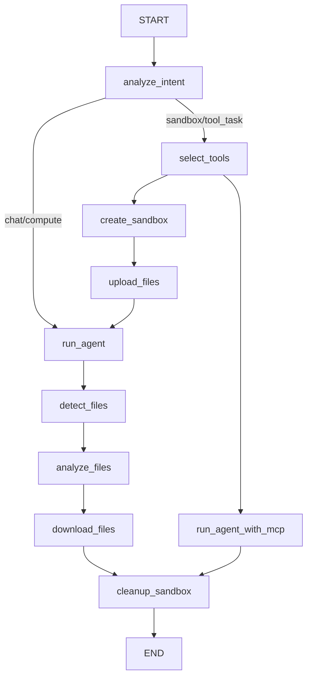

# LLM 驱动的技能与工具按需选择方案

> 在执行链路中引入 `select_tools` 节点，通过 LLM 根据任务意图从可用技能和 MCP 工具中动态选择最相关的子集加载。

> **状态**: 设计稿
> **创建**: 2026-06-03

## 1. 背景与问题

### 1.1 现状

当前 `run_agent`（沙箱路线）和 `run_agent_with_mcp`（工具调用路线）在执行前会**全量加载**所有资源：

- **Skills**: `discover_skills()` 找到 `{DATA_DIR}/skills/` 下所有技能，全部上传到沙箱
- **MCP 工具**: `get_enabled_servers()` 返回所有已启用的 MCP server，所有工具的 `BaseTool` 实例一股脑传入 `create_deep_agent(tools=[...])`

### 1.2 问题

1. **Prompt 膨胀**: 每个 MCP 工具的 `BaseTool` 实例都会在 LLM 的 tool calling 阶段被序列化成 schema，工具越多，LLM 推理负担越重
2. **误选风险**: 无关工具出现在 tool list 中，LLM 可能错误地调用不相关的工具（如分析 CSV 的任务去调用天气查询工具）
3. **技能噪音**: SkillsMiddleware 虽然是渐进披露，但无关技能的描述依然占据 system prompt 空间

## 2. 设计

### 2.1 核心思路

在 `analyze_intent` 确定任务类型后，插入一个轻量级 LLM 调用，让 LLM 根据以下信息选择需要加载的技能和工具：

- 用户的原始请求（`user_request`）
- 意图分类结果（`task_type`）
- 可用技能列表（名称 + 描述）
- 可用 MCP 工具列表（名称 + 描述）

### 2.2 流程图



- **chat/compute**: 无需加载任何工具/技能，直接跳过 `select_tools`
- **code_exec / data_analysis / multi_step**: 走 `select_tools` → `create_sandbox` → ... → `run_agent`（Skills + MCP 按需加载）
- **tool_task**: 走 `select_tools` → `run_agent_with_mcp`（仅 MCP 按需加载）

### 2.3 新增节点: `select_tools`

#### 位置

`src/agent/nodes.py` 中新写一个 `select_tools` 节点函数，置于 `analyze_intent` 之后、资源加载之前。

#### 输入

| 来源 | 字段 | 说明 |
|------|------|------|
| state | `task_type` | 意图分析的分类结果 |
| state | `messages[-1].content` | 用户原始请求 |
| 主动发现 | `discover_skills()` | 所有可用技能（name + description） |
| 主动查询 | MCP 数据库 | 所有已启用的 MCP 工具（name + description） |

#### 输出（写入 state）

```python
# 新增到 state.py
selected_skills: list[str] = []       # 要加载的技能名列表（空 = 不加载任何技能）
selected_mcp_tools: list[str] = []    # 要加载的 MCP 工具标识列表
```

工具标识格式：`{server_name}:{tool_name}`（server 名 + 工具名，冒号分隔，避免跨 server 重名冲突）。

#### 处理逻辑

```python
def select_tools(state: SandboxAgentState) -> dict[str, Any]:
    """
    【车间：工具选择】
    用 LLM 从可用技能和 MCP 工具中选出当前任务需要的子集。
    LLM 失败时回退到全量加载（当前行为）。
    """
    task_type = state.get("task_type", "chat")
    user_request = state["messages"][-1].content
    print(f"[工具选择] task_type={task_type}")

    # 1. 发现可用资源
    skills_list = discover_skills()
    mcp_tools = list_tools(enabled_only=True)  # 只查已启用的

    # 2. 如果没有可选的，直接返回空
    if not skills_list and not mcp_tools:
        print("[工具选择] 无可用技能或工具")
        return {"execution_phase": "select_tools"}

    # 3. 构建 LLM 选择 prompt
    prompt = _SELECT_TOOLS_PROMPT.format(
        task_type=task_type,
        user_request=user_request,
        skills_catalog=_format_skills_catalog(skills_list),
        tools_catalog=_format_tools_catalog(mcp_tools),
    )

    # 4. LLM 调用
    try:
        response = llm.invoke([HumanMessage(content=prompt)])
        parsed = _parse_intent_json(response.content)
        if parsed:
            selected_skills = parsed.get("skills", [])
            selected_tools = parsed.get("mcp_tools", [])
            reasoning = parsed.get("reasoning", "")
            print(f"[工具选择] LLM 选择: skills={selected_skills}, tools={selected_tools}")
            if reasoning:
                print(f"[工具选择]   推理: {reasoning}")
            # 前端展示
            print(f"[STATUS] select_tools_detail|🎯 技能: {', '.join(selected_skills) or '（无）'}")
            print(f"[STATUS] select_tools_detail|🔧 工具: {', '.join(selected_tools) or '（无）'}")
            return {
                "selected_skills": selected_skills,
                "selected_mcp_tools": selected_tools,
                "execution_phase": "select_tools",
            }
    except Exception as e:
        print(f"[工具选择] ⚠️ LLM 选择失败 ({type(e).__name__})，回退到全量加载")

    # 5. Fallback: 全量加载（当前行为）
    all_skills = [s["name"] for s in skills_list]
    all_tools = _all_tool_ids(mcp_tools)
    print(f"[工具选择] 回退到全量加载: skills={all_skills}, tools={all_tools}")
    return {
        "selected_skills": all_skills,
        "selected_mcp_tools": all_tools,
        "execution_phase": "select_tools",
    }
```

#### 选择 Prompt

```text
You are an intelligent tool selection assistant. Choose the most relevant skills and 
MCP tools for the given task.

Task Type: {task_type}
- chat: Pure conversation, no tools needed
- compute: Simple calculation, no tools needed
- tool_task: Needs external API access (weather, DB queries, etc.)
- code_exec: Write and execute code
- data_analysis: Analyze uploaded files
- multi_step: Complex multi-file project

User Request: {user_request}

Available Skills:
{skills_catalog}

Available MCP Tools:
{tools_catalog}

Select ONLY what is directly relevant to THIS specific task.
- Skills are workflow instructions that guide HOW to approach a task.
- MCP tools are external APIs the agent can call.
- For tool_task: focus on MCP tools that match the needed external data.
- For data_analysis: data-related tools and analytical skills.
- For code_exec/multi_step: development-oriented skills and tools.
- For chat/compute: select nothing (empty arrays).
- When in doubt, UNDER-select. The agent can work without extras.
- Return empty arrays if nothing is needed.

Respond in JSON format only:
{{"reasoning": "Brief explanation", "skills": ["skill-name"], "mcp_tools": ["server:tool-name"]}}
```

### 2.4 路由变更

```python
def route_after_analysis(state: SandboxAgentState) -> str:
    """analyze_intent → 三岔路口"""
    task_type = state.get("task_type", "chat")
    sandbox_types = {"code_exec", "data_analysis", "multi_step"}
    if task_type in sandbox_types or task_type == "tool_task":
        return "select_tools"   # 需要工具选择的路线
    return "run_agent"          # chat/compute 跳过


def route_after_selection(state: SandboxAgentState) -> str:
    """select_tools → 分叉到沙箱或工具调用"""
    task_type = state.get("task_type", "chat")
    sandbox_types = {"code_exec", "data_analysis", "multi_step"}
    if task_type in sandbox_types:
        return "create_sandbox"
    if task_type == "tool_task":
        return "run_agent_with_mcp"
    return "run_agent"  # 理论上不会走到这里
```

图注册：

```python
builder.add_node("select_tools", select_tools)

builder.add_conditional_edges(
    "analyze_intent",
    route_after_analysis,
    {
        "select_tools": "select_tools",
        "run_agent": "run_agent",
    }
)

builder.add_conditional_edges(
    "select_tools",
    route_after_selection,
    {
        "create_sandbox": "create_sandbox",
        "run_agent_with_mcp": "run_agent_with_mcp",
    }
)
```

### 2.5 资源加载处修改

#### `run_agent`（沙箱路线）

```python
# Skills: 只加载被选中的
skills_list = discover_skills()
selected_skill_names = set(state.get("selected_skills", skills_list))
if selected_skill_names:
    skills_list = [s for s in skills_list if s["name"] in selected_skill_names]

# MCP: 只加载被选中的 tool
selected_tool_ids = set(state.get("selected_mcp_tools", []))
for server in get_enabled_servers():
    tools = build_tools_for_server(server)
    if selected_tool_ids:
        tools = [t for t in tools if f"{server['name']}:{t.name}" in selected_tool_ids]
    mcp_additional_tools.extend(tools)
```

Skills 的 loading 日志从"加载了 N 个技能"改为"加载了 N/M 个技能（按需）"：
```
[STATUS] load_skills_detail|🎯 2/4 个技能: tdd, debug (按需选择)
```

#### `run_agent_with_mcp`（工具路线）

```python
selected_tool_ids = set(state.get("selected_mcp_tools", []))
for server in get_enabled_servers():
    tools = build_tools_for_server(server)
    if selected_tool_ids:
        tools = [t for t in tools if f"{server['name']}:{t.name}" in selected_tool_ids]
    mcp_additional_tools.extend(tools)
```

### 2.6 State 变更

```python
# state.py 新增字段
selected_skills: list[str] = []       # 选中的技能名列表
selected_mcp_tools: list[str] = []    # 选中的工具标识列表 (server:name)
```

API 侧 `input_data` 初始化时补充：
```python
input_data = {
    ...
    "selected_skills": [],
    "selected_mcp_tools": [],
}
```

## 3. 关键决策记录

| 决策 | 选择 | 理由 |
|------|------|------|
| 独立节点 vs 扩展 analyze_intent | **独立节点** | 避免分析 prompt 膨胀；chat/compute 不走选择，节省 LLM 调用；关注点分离 |
| 一次 LLM 调用 vs 两次 | **一次** | Skills 和 MCP 的选择可以合并，一次调用更省 |
| 工具标识格式 | `server_name:tool_name` | 跨 server 重名保护，且 LLM 可读 |
| 选择失败回退 | **全量加载** | 安全降级，不丢功能 |
| 选择 LLM 模型 | **与主 LLM 相同** | 无需额外配置；简单分类任务任何模型都能胜任 |
| temperature | **0.1** | 低随机性，确保选择一致性 |

## 4. 用户可见变化

执行时间线增加一步 `⛏️ 正在选择工具...`，展示选中结果：

```
⛏️ 正在选择工具...
  🎯 技能: tdd, debug
  🔧 工具: weather-api
```

`load_skills` / `load_mcp` 的日志从全量改为按需：

```
🎯 正在加载技能...
  🎯 2/4 个技能: tdd, debug (按需选择)

🔧 正在加载 MCP 工具...
  🔧 1/3 个工具: weather-api (按需选择)
```

## 5. 风险与缓解

| 风险 | 缓解 |
|------|------|
| LLM 选择结果不稳定 | temperature=0.1 + 明确的规则文本 + JSON 约束 |
| LLM 选择空集导致工具缺失 | 前端仍可观察加载阶段；用户可重试；全量回退是兜底 |
| LLM 选择无关工具 | prompt 强调"under-select"原则；工具描述质量是关键 |
| 额外 LLM 调用增加延迟 | 分类任务模型响应快（~100-200ms），与沙箱创建并行化 |
| Skills 缺少描述字段 | 当前两个技能已有 frontmatter description，后续新增技能需补充 |

## 6. 验收标准

- [ ] `select_tools` 节点在 sandbox/tool_task 路线中正确执行，chat/compute 路线跳过
- [ ] 选择的技能子集正确传递给 `run_agent`，未选择的技能不上传
- [ ] 选择的 MCP 工具子集正确注入 agent，未选择的工具不出现
- [ ] LLM 选择失败时回退到全量加载
- [ ] 前端时间线显示 `select_tools` 及其详情
- [ ] 现有测试全部通过（现有行为不受影响）
